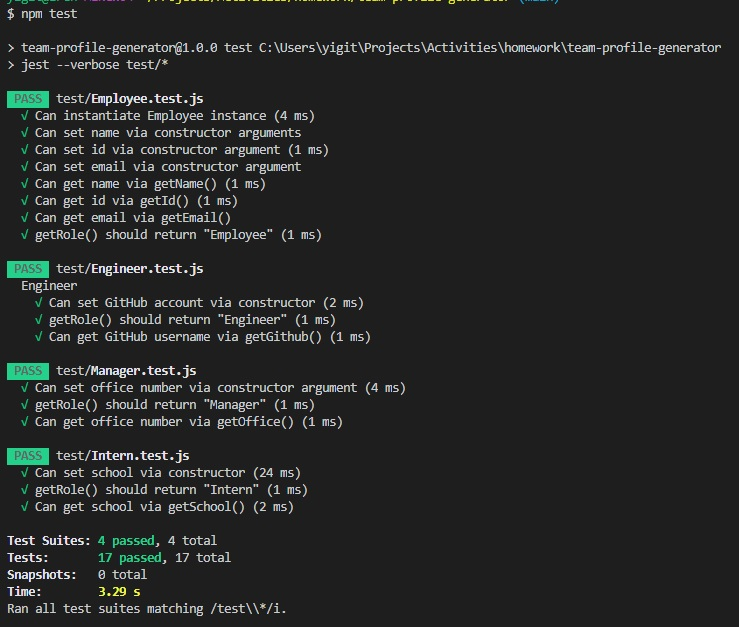

##  **Team Profile Generator**


## Table of Contents

* [Description](#description)
* [Requirements](#requirements)
* [Test](#test)
* [Installation](#installation)

## Description
---
This project builds a team HTML file for the user based on their inputs. The user inputs the Manager information first then they can choose to add more employees to the team.

---

## Requirements
---

```md
GIVEN a command-line application that accepts user input
WHEN I am prompted for my team members and their information
THEN an HTML file is generated that displays a nicely formatted team roster based on user input
WHEN I click on an email address in the HTML
THEN my default email program opens and populates the TO field of the email with the address
WHEN I click on the GitHub username
THEN that GitHub profile opens in a new tab
WHEN I start the application
THEN I am prompted to enter the team manager’s name, employee ID, email address, and office number
WHEN I enter the team manager’s name, employee ID, email address, and office number
THEN I am presented with a menu with the option to add an engineer or an intern or to finish building my team
WHEN I select the engineer option
THEN I am prompted to enter the engineer’s name, ID, email, and GitHub username, and I am taken back to the menu
WHEN I select the intern option
THEN I am prompted to enter the intern’s name, ID, email, and school, and I am taken back to the menu
WHEN I decide to finish building my team
THEN I exit the application, and the HTML is generated

```

## Test

---




## Installation
---
There is no installations to this project, you can see the repository and video of how to use it here.

See repository here: https://github.com/erenozgur98/team-profile-generator

See video link here: https://drive.google.com/file/d/17fxMztb4cHUgQ8DoAEnQtTS4FucwuQDM/view
